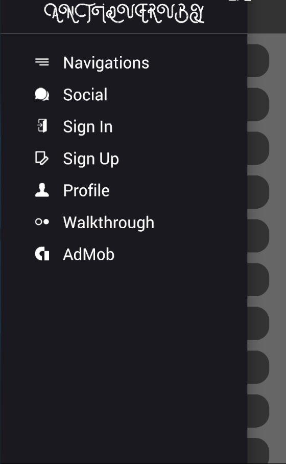
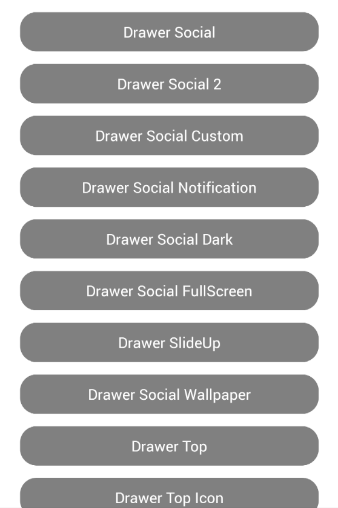

# Antiqueruby General Material UI Template App

## How to Setup

**Step 1:** git clone this repo:

**Step 2:** cd to the cloned repo:

**Step 3:** Install the Application with `yarn` or `npm i`

## How to Run App

1. cd to the repo
2. Run Build for either OS

- for iOS
  - run `react-native run-ios`
- for Android
  - Run Genymotion or android emulator
  - run `react-native run-android`

    
    

